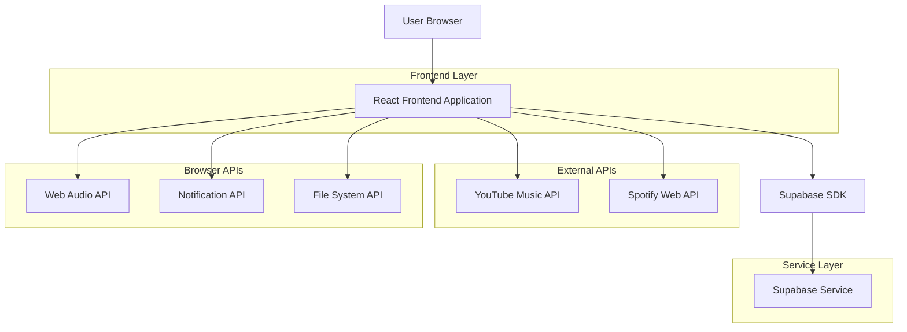
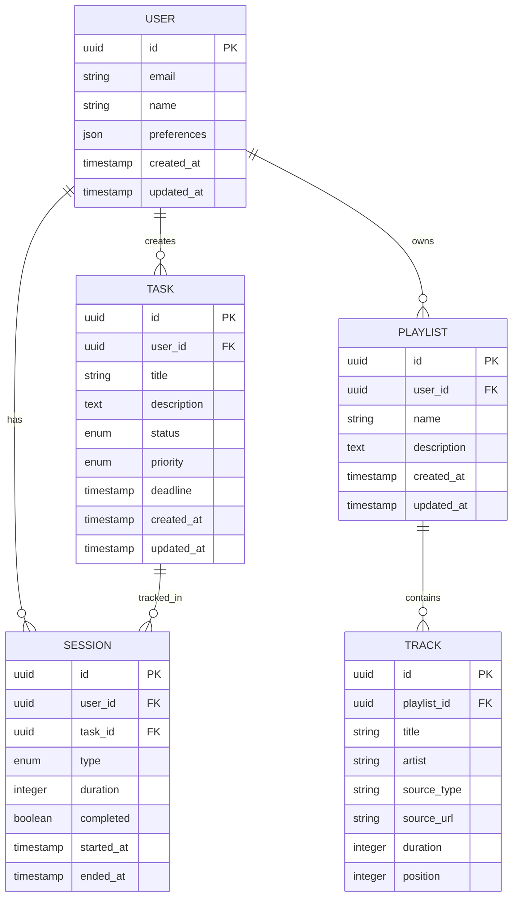

# Dokumentasi Arsitektur Teknis - Pomodoro Timer

## 1. Desain Arsitektur



## 2. Deskripsi Teknologi

* Frontend: React\@18 + TypeScript + Tailwind CSS\@3 + Framer Motion + Vite

* Backend: Supabase (Authentication, Database, Storage)

* Audio: Web Audio API, YouTube Music API, Spotify Web API

* Notifications: Web Notifications API, Web Audio API untuk suara

* Storage: LocalStorage, IndexedDB, Supabase Storage

## 3. Definisi Route

| Route     | Tujuan                                                     |
| --------- | ---------------------------------------------------------- |
| /         | Halaman utama dengan timer Pomodoro dan kontrol musik      |
| /tasks    | Halaman manajemen tugas dengan kanban board dan to-do list |
| /music    | Halaman pemutar musik dengan playlist dan streaming        |
| /settings | Halaman pengaturan timer, notifikasi, dan preferensi       |
| /stats    | Halaman statistik dan ekspor data                          |

## 4. Definisi API

### 4.1 Core API

Manajemen Tugas

```
GET /api/tasks
```

Response:

| Nama Parameter | Tipe Parameter | Deskripsi                                  |
| -------------- | -------------- | ------------------------------------------ |
| id             | string         | ID unik tugas                              |
| title          | string         | Judul tugas                                |
| description    | string         | Deskripsi tugas                            |
| status         | enum           | Status: 'todo', 'in-progress', 'completed' |
| priority       | enum           | Prioritas: 'low', 'medium', 'high'         |
| created\_at    | timestamp      | Waktu pembuatan                            |
| updated\_at    | timestamp      | Waktu update terakhir                      |

```
POST /api/tasks
```

Request:

| Nama Parameter | Tipe Parameter | Wajib | Deskripsi       |
| -------------- | -------------- | ----- | --------------- |
| title          | string         | true  | Judul tugas     |
| description    | string         | false | Deskripsi tugas |
| priority       | enum           | false | Prioritas tugas |

Sesi Pomodoro

```
POST /api/sessions
```

Request:

| Nama Parameter | Tipe Parameter | Wajib | Deskripsi                                 |
| -------------- | -------------- | ----- | ----------------------------------------- |
| task\_id       | string         | false | ID tugas yang dikerjakan                  |
| duration       | number         | true  | Durasi sesi dalam menit                   |
| type           | enum           | true  | Tipe: 'work', 'short-break', 'long-break' |

Playlist Management

```
GET /api/playlists
POST /api/playlists
PUT /api/playlists/:id
DELETE /api/playlists/:id
```

## 5. Model Data

### 5.1 Definisi Model Data



### 5.2 Data Definition Language

Tabel Users

```sql
CREATE TABLE users (
    id UUID PRIMARY KEY DEFAULT gen_random_uuid(),
    email VARCHAR(255) UNIQUE,
    name VARCHAR(100),
    preferences JSONB DEFAULT '{}',
    created_at TIMESTAMP WITH TIME ZONE DEFAULT NOW(),
    updated_at TIMESTAMP WITH TIME ZONE DEFAULT NOW()
);

GRANT SELECT ON users TO anon;
GRANT ALL PRIVILEGES ON users TO authenticated;
```

Tabel Tasks

```sql
CREATE TABLE tasks (
    id UUID PRIMARY KEY DEFAULT gen_random_uuid(),
    user_id UUID REFERENCES users(id),
    title VARCHAR(255) NOT NULL,
    description TEXT,
    status VARCHAR(20) DEFAULT 'todo' CHECK (status IN ('todo', 'in-progress', 'completed')),
    priority VARCHAR(10) DEFAULT 'medium' CHECK (priority IN ('low', 'medium', 'high')),
    deadline TIMESTAMP WITH TIME ZONE,
    created_at TIMESTAMP WITH TIME ZONE DEFAULT NOW(),
    updated_at TIMESTAMP WITH TIME ZONE DEFAULT NOW()
);

CREATE INDEX idx_tasks_user_id ON tasks(user_id);
CREATE INDEX idx_tasks_status ON tasks(status);
CREATE INDEX idx_tasks_priority ON tasks(priority);

GRANT SELECT ON tasks TO anon;
GRANT ALL PRIVILEGES ON tasks TO authenticated;
```

Tabel Sessions

```sql
CREATE TABLE sessions (
    id UUID PRIMARY KEY DEFAULT gen_random_uuid(),
    user_id UUID REFERENCES users(id),
    task_id UUID REFERENCES tasks(id),
    type VARCHAR(20) NOT NULL CHECK (type IN ('work', 'short-break', 'long-break')),
    duration INTEGER NOT NULL,
    completed BOOLEAN DEFAULT false,
    started_at TIMESTAMP WITH TIME ZONE DEFAULT NOW(),
    ended_at TIMESTAMP WITH TIME ZONE
);

CREATE INDEX idx_sessions_user_id ON sessions(user_id);
CREATE INDEX idx_sessions_started_at ON sessions(started_at DESC);

GRANT SELECT ON sessions TO anon;
GRANT ALL PRIVILEGES ON sessions TO authenticated;
```

Tabel Playlists

```sql
CREATE TABLE playlists (
    id UUID PRIMARY KEY DEFAULT gen_random_uuid(),
    user_id UUID REFERENCES users(id),
    name VARCHAR(255) NOT NULL,
    description TEXT,
    created_at TIMESTAMP WITH TIME ZONE DEFAULT NOW(),
    updated_at TIMESTAMP WITH TIME ZONE DEFAULT NOW()
);

CREATE INDEX idx_playlists_user_id ON playlists(user_id);

GRANT SELECT ON playlists TO anon;
GRANT ALL PRIVILEGES ON playlists TO authenticated;
```

Tabel Tracks

```sql
CREATE TABLE tracks (
    id UUID PRIMARY KEY DEFAULT gen_random_uuid(),
    playlist_id UUID REFERENCES playlists(id) ON DELETE CASCADE,
    title VARCHAR(255) NOT NULL,
    artist VARCHAR(255),
    source_type VARCHAR(20) NOT NULL CHECK (source_type IN ('local', 'youtube', 'spotify')),
    source_url TEXT,
    duration INTEGER,
    position INTEGER NOT NULL,
    created_at TIMESTAMP WITH TIME ZONE DEFAULT NOW()
);

CREATE INDEX idx_tracks_playlist_id ON tracks(playlist_id);
CREATE INDEX idx_tracks_position ON tracks(position);

GRANT SELECT ON tracks TO anon;
GRANT ALL PRIVILEGES ON tracks TO authenticated;
```

Data Inisial

```sql
INSERT INTO users (email, name, preferences) VALUES 
('demo@example.com', 'Demo User', '{"work_duration": 25, "short_break": 5, "long_break": 15, "theme": "dark"}');

INSERT INTO tasks (user_id, title, description, priority) VALUES 
((SELECT id FROM users WHERE email = 'demo@example.com'), 'Setup Pomodoro Timer', 'Configure initial settings and preferences', 'high'),
((SELECT id FROM users WHERE email = 'demo@example.com'), 'Create First Playlist', 'Add some favorite songs for focus sessions', 'medium');
```

