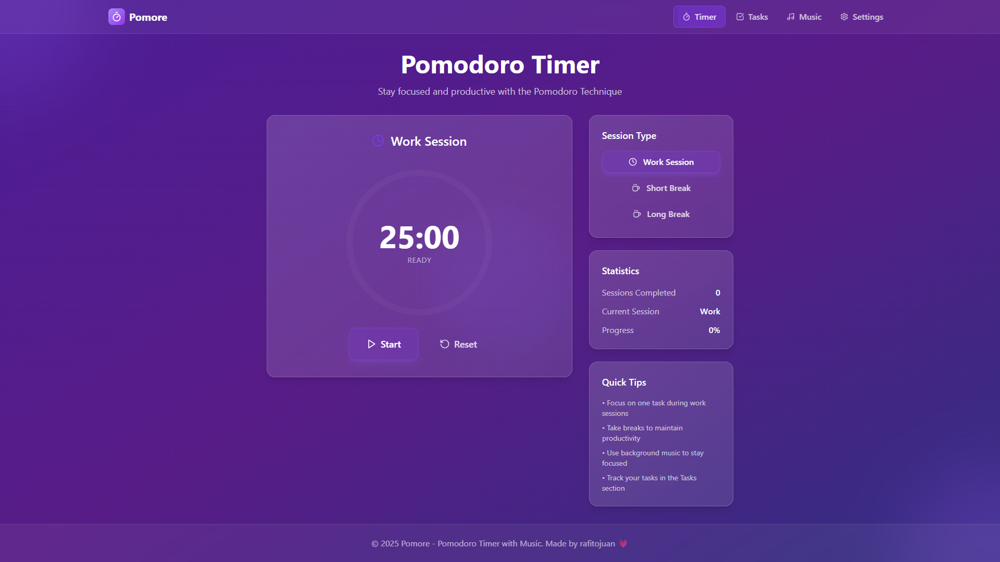

# 🍅 Pomore - Pomodoro Timer App

Aplikasi Pomodoro Timer yang elegan dan powerful untuk meningkatkan produktivitas Anda! Dibangun dengan React + TypeScript + Vite dengan antarmuka yang modern dan fitur-fitur canggih.

## ✨ Fitur Utama

### ⏰ Timer Pomodoro Cerdas

- Timer dengan sesi kerja dan istirahat yang dapat disesuaikan
- Notifikasi browser otomatis ketika sesi selesai
- Kontrol mudah dengan tombol play, pause, dan reset

### 🎵 Pemutar Musik Terintegrasi

- Streaming musik dari YouTube untuk menemani sesi kerja
- Kontrol volume dan playlist yang mudah digunakan
- Mini player yang tidak mengganggu fokus

### 📋 Manajemen Tugas

- Buat, edit, dan hapus tugas dengan mudah
- Tandai tugas sebagai selesai
- Ekspor data tugas ke berbagai format

### ⚙️ Pengaturan Fleksibel

- Atur durasi sesi kerja dan istirahat sesuai kebutuhan
- Pilihan tema dan personalisasi tampilan
- Pengaturan notifikasi yang dapat dikustomisasi

## 📱 Tampilan Aplikasi

### Dashboard Utama

_Tampilan utama dengan timer Pomodoro yang elegan_

### Timer Interface

.png>)
_Interface timer dengan kontrol yang intuitif_

### Manajemen Tugas

.png>)
_Kelola tugas-tugas Anda dengan mudah_

### Pemutar Musik

.png>)
_Pemutar musik terintegrasi untuk menemani sesi kerja_

### Pengaturan

.png>)
_Kustomisasi aplikasi sesuai preferensi Anda_

### Notifikasi

.png>)
_Sistem notifikasi yang membantu Anda tetap fokus_

## 🚀 Teknologi yang Digunakan

- **React 18** + **TypeScript** - Framework modern untuk UI yang responsif
- **Vite** - Build tool yang super cepat
- **Tailwind CSS** - Styling yang elegant dan konsisten
- **Framer Motion** - Animasi yang smooth dan menarik
- **Web Notifications API** - Notifikasi browser yang terintegrasi

## 🔔 Cara Mengaktifkan Notifikasi Browser

Untuk pengalaman terbaik, aktifkan notifikasi browser:

**Chrome/Edge:**

1. Klik ikon gembok di sebelah kiri URL
2. Pilih "Notifications" → "Allow"

**Firefox:**

1. Klik ikon perisai di sebelah kiri URL
2. Ubah Notifications ke "Allow"

**Safari:**

1. Safari → Preferences → Websites → Notifications
2. Ubah ke "Allow" untuk domain aplikasi

## 🎯 Mengapa Pomore?

- **Sederhana namun Powerful** - Interface yang clean dengan fitur lengkap
- **Produktivitas Maksimal** - Teknik Pomodoro yang terbukti efektif
- **Hiburan Terintegrasi** - Musik untuk menemani sesi kerja
- **Manajemen Tugas** - Kelola to-do list dalam satu aplikasi
- **Customizable** - Sesuaikan dengan gaya kerja Anda

## 👨‍💻 Credit

Dibuat dengan ❤️ oleh **rafitojuan**

---

_Tingkatkan produktivitas Anda dengan Pomore - aplikasi Pomodoro Timer yang sempurna untuk fokus dan efisiensi!_
