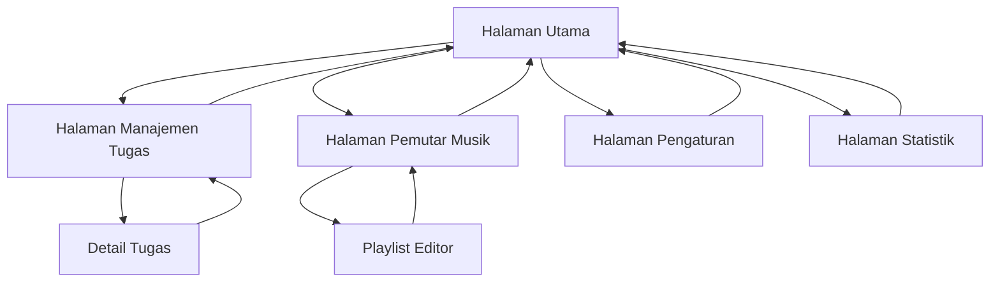

# Dokumentasi Persyaratan Produk - Pomodoro Timer

## 1. Gambaran Produk
Aplikasi Pomodoro Timer yang komprehensif dengan sistem pelacakan tugas terintegrasi, pemutar musik multi-platform, dan antarmuka modern minimalis. Aplikasi ini menggabungkan teknik produktivitas Pomodoro dengan manajemen tugas yang efektif dan pengalaman audio yang dipersonalisasi.

Target pengguna adalah profesional, pelajar, dan individu yang ingin meningkatkan produktivitas dengan metode Pomodoro sambil mengelola tugas dan menikmati musik favorit mereka.

## 2. Fitur Utama

### 2.1 Peran Pengguna
| Peran | Metode Registrasi | Izin Utama |
|-------|-------------------|------------|
| Pengguna | Akses langsung tanpa registrasi | Dapat menggunakan semua fitur, menyimpan preferensi lokal |

### 2.2 Modul Fitur
Aplikasi Pomodoro Timer terdiri dari halaman-halaman utama berikut:
1. **Halaman Utama**: timer Pomodoro, kontrol musik, status tugas aktif
2. **Halaman Manajemen Tugas**: kanban board, to-do list, status tugas
3. **Halaman Pemutar Musik**: kontrol musik, playlist, integrasi streaming
4. **Halaman Pengaturan**: konfigurasi timer, notifikasi, preferensi audio
5. **Halaman Statistik**: riwayat sesi, produktivitas, ekspor data

### 2.3 Detail Halaman
| Nama Halaman | Nama Modul | Deskripsi Fitur |
|--------------|------------|------------------|
| Halaman Utama | Timer Pomodoro | Tampilkan countdown timer, kontrol start/pause/reset, indikator sesi kerja/istirahat |
| Halaman Utama | Widget Tugas | Tampilkan tugas aktif, quick actions untuk mengubah status tugas |
| Halaman Utama | Kontrol Musik Mini | Play/pause musik, informasi lagu saat ini, volume control |
| Halaman Manajemen Tugas | Kanban Board | Drag-and-drop tugas antar kolom (Belum Mulai, Sedang Dikerjakan, Selesai) |
| Halaman Manajemen Tugas | To-Do List | Tambah, edit, hapus tugas dengan prioritas dan deadline |
| Halaman Manajemen Tugas | Filter & Pencarian | Filter tugas berdasarkan status, prioritas, tanggal |
| Halaman Pemutar Musik | Upload Lokal | Upload dan putar file musik dari perangkat |
| Halaman Pemutar Musik | Streaming Integration | Paste link YouTube Music dan Spotify untuk streaming |
| Halaman Pemutar Musik | Playlist Manager | Buat, edit, simpan playlist dengan musik dari berbagai sumber |
| Halaman Pengaturan | Timer Configuration | Atur durasi kerja, istirahat pendek, istirahat panjang |
| Halaman Pengaturan | Notifikasi Settings | Konfigurasi notifikasi visual, suara, alarm kustom |
| Halaman Pengaturan | Audio Preferences | Pengaturan volume, kualitas audio, auto-play |
| Halaman Statistik | Session History | Riwayat sesi Pomodoro dengan grafik produktivitas |
| Halaman Statistik | Data Export | Ekspor daftar tugas ke format TXT, backup preferensi |

## 3. Alur Proses Utama
Pengguna memulai dengan mengatur tugas di halaman manajemen tugas, kemudian kembali ke halaman utama untuk memulai sesi Pomodoro. Selama sesi berlangsung, pengguna dapat mengontrol musik dan melihat progress tugas. Ketika timer berakhir, sistem mengirim notifikasi dan pengguna dapat beralih ke sesi istirahat atau melanjutkan dengan tugas berikutnya.

## 4. Desain Antarmuka Pengguna
### 4.1 Gaya Desain
- Warna primer: #7C3AED (ungu vibrant)
- Warna sekunder: #A855F7 (ungu muda), #1F2937 (abu gelap)
- Gaya tombol: Rounded dengan efek glassmorphism dan hover animations
- Font: Inter atau Poppins dengan ukuran 14px-24px untuk teks utama
- Gaya layout: Card-based dengan glassmorphism, navigasi samping yang dapat disembunyikan
- Ikon: Outline style dengan animasi micro-interactions

### 4.2 Gambaran Desain Halaman
| Nama Halaman | Nama Modul | Elemen UI |
|--------------|------------|----------|
| Halaman Utama | Timer Pomodoro | Circular progress ring dengan glassmorphism, gradient background #7C3AED ke #A855F7, animated countdown |
| Halaman Utama | Widget Tugas | Floating card dengan backdrop blur, task progress bar, status badges dengan warna-coding |
| Halaman Utama | Kontrol Musik Mini | Compact player dengan album art blur background, animated equalizer bars |
| Halaman Manajemen Tugas | Kanban Board | Three-column layout dengan drag-drop animations, card shadows dan hover effects |
| Halaman Pemutar Musik | Playlist Manager | Grid layout untuk playlist covers, modal untuk editing dengan smooth transitions |
| Halaman Pengaturan | Configuration Panels | Accordion-style sections dengan smooth expand/collapse animations |

### 4.3 Responsivitas
Aplikasi dirancang mobile-first dengan adaptasi desktop. Optimasi touch interaction untuk mobile dengan gesture support untuk drag-and-drop dan swipe actions. Breakpoints: mobile (<768px), tablet (768px-1024px), desktop (>1024px).